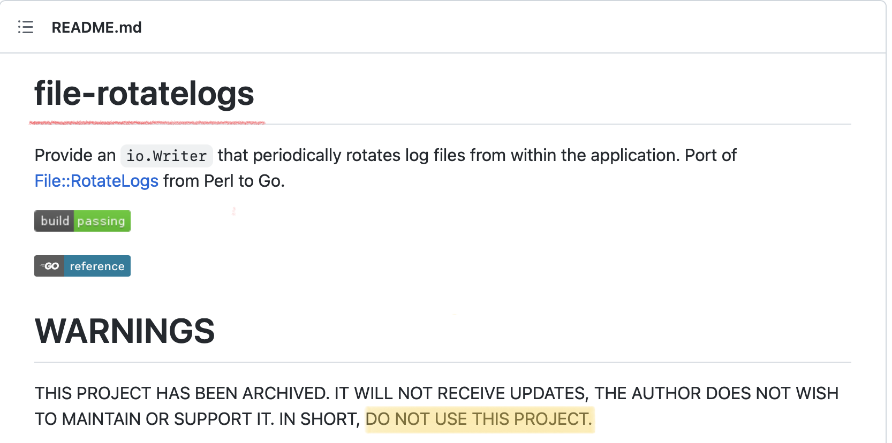

# [GO] 日志文件切分功能开发心得

之前工程日志都是直接打到文件中的。但时间长了之后日志文件就变得非常大。不仅业务出问题的时候查日志非常难。而且还出现过因为日志文件过大导致程序卡死的情况。所以有空了之后就想看看有没有对应的库或者自己造个轮子解决这个问题。

## 分析

谷歌搜索 “go 日志切分”。 搜到的博客里大多是建议使用 file-rotatelogs 库。比如在[这篇博客](https://blog.csdn.net/qianghaohao/article/details/104103717)里就是这么介绍的：

>logrus 本身不支持日志轮转切割功能，需要配合 file-rotatelogs 包来实现，防止日志打满磁盘。file-rotatelogs 实现了 io.Writer 接口，并且提供了文件的切割功能，其实例可以作为 logrus 的目标输出，两者能无缝集成，这也是 file-rotatelogs 的设计初衷：
>————————————————
>版权声明：本文为CSDN博主「qhh0205」的原创文章，遵循CC 4.0 BY-SA版权协议，转载请附上原文出处链接及本声明。
>原文链接：https://blog.csdn.net/qianghaohao/article/details/104103717

但 [file-rotatelogs](https://github.com/lestrrat-go/file-rotatelogs) 这个库其实已经被库作者归档了。而且该工程基于 go 1.12。已经几年没有更新了。作者也在 REAME 中明确说明了不要使用该库。



其实在 [pkg.go.dev](https://pkg.go.dev/search?q=rotate+log) 里搜索 "rotate log" 还是能搜到不少库的。


但这些库的 star 数……还有很大的进步空间。所以还是决定自己写了。

## 思路

各个 log 库大都会要求使用 io.Writer 初始化。所以我们可以实现一个 io.Writer 代理结构。该结构直接调用底层被代理的 io.Writer 对象的 Write 方法。然后在时间或日志大小之类的条件满足时切换底层的 io.Writer 对象。这样就能实现日志切分功能了。

## 性能

因为是公司代码，所以就不贴具体实现了。直接放性能测试结果。

```
BenchmarkFile-10           1147120      2094 ns/op       16 B/op     1 allocs/op
BenchmarkMyWriter-10        951513      2150 ns/op       16 B/op     1 allocs/op
BenchmarkRotatelogs-10      568401      3830 ns/op      384 B/op     5 allocs/op
```

这三个测试都用了标准库的作为 logger。BenchmarkFile 底层用了 os.File；BenchmarkMyWriter 底层用了笔者写的逻辑；BenchmarkRotatelogs 底层用了 file-rotatelogs。可以看到，相较于直接使用单个文件来说，笔者写的逻辑产生的性能损失并不多。而 file-rotatelogs 库在各个方面的表现确实更差一些。

## 心得

开发这个功能时还是有不少值得拿出来说的点的。~~不然也不会写这篇文章不是？~~

* 并行代码记得检查数据竞争问题。

可能被并行调用的代码，在测试时一定要记得添加 `-race` 参数。很多表面看着没问题的代码其实会有数据竞争问题。这个参数 `go test` 和 `go run` 命令都能用。所以即使不写测试，在写业务代码时也尽量手动测试一下。

* 尽量减少锁的覆盖范围。

其实不需要把整个 Write 方法锁住。只需要锁住 “获取或创建底层 Writer” 的逻辑就可以了。没必要也不能对底层 Writer 对象的 Write 方法加锁。

```go
func (w *writer) Write(p []byte) (n int, err error) {
	var wc io.WriteCloser
	w.sync(func() { wc, err = w.load() }) // 获取或创建底层 Writer
	if err != nil {
		return 0, err
	}
	return wc.Write(p)
}

// 加锁保护 f 执行
func (w *writer) sync(f func()) {
	w.mu.Lock()
	defer w.mu.Unlock()
	f()
}
```

* 按文件大小切分时的取巧方法。

写一个代理 Writer，在每次调用底层 Writer 的 Write 方法成功后累加此次写入的长度。这样就能在不调用 `os.Stat` 的情况下统计写入的日志文件的大小了。

另外，要是只想重写接口的部分方法的话。可以将接口直接嵌入结构中。这样未被重写的部分就直接由嵌入的接口提供了。比如下面的 writeCloser 结构体中就嵌入了 io.WriteCloser。io.WriteCloser 的 Close 方法就不需要该结构体再去实现了。context 包的各个 Context 也是这个套路。

```go
type writeCloser struct {
	io.WriteCloser
	n int64
}

func (wc *writeCloser) Write(p []byte) (n int, err error) {
	n, err = wc.WriteCloser.Write(p)
	if err == nil {
		atomic.AddInt64(&wc.n, int64(n))
	}
	return
}
```

